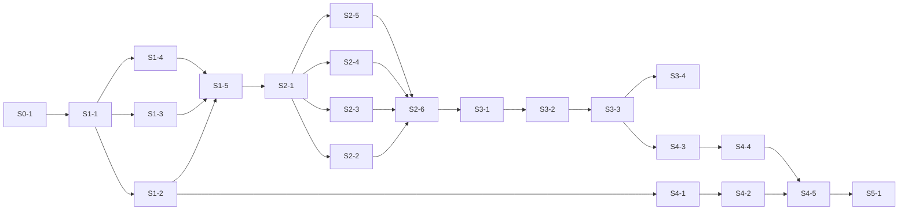

# jfast MVP 实施计划总览

> 来源：地图 [地图:jfast MVP 施工 spec —— 从蓝图到可领工的实施计划](https://github.com/hhhrrr777/jfast/issues/15) 与收官票据 [#24](https://github.com/hhhrrr777/jfast/issues/24) 的决议(两轮 grilling,Q1–Q11 全按推荐落定)。
> 约束:`CONTEXT.md` 词汇表 + `docs/adr/` ADR-0001~0009,施工不得与之冲突。
> 范围：严格等于蓝图 MVP——#9 功能清单 + 两档预设 + CI 门禁 + 实体建模前后端。**写代码的执行在任务 issue 中进行,本文档是唯一总览。**

## 施工路线(已拍板)

混合式四段:**CLI 骨架 + base 管线先行打通并立 CI 门禁 → `baseline/` 目录手工构建真实完整后台应用并人工验证 → 模板化搬进 `templates/presets/full/` → 实体建模**。

关键源流决策(#24-Q1):`baseline/` 以 `jfast new --preset empty` 的**生成物为起点**手工叠加完整后台功能,base 与 full 天然同源;阶段 S3 模板化时 baseline 与 base 的 diff 即是 overlay 拆分清单,原「逐文件拆分清单」迷雾项随之消解。

## 单元总表

粒度判据:**一个 agent 会话可独立完成并验收**。共 21 个单元,T1–T6(ADR-0009 测试基建)已编织进位。

| 单元 | 内容 | 前置 | 执行者 |
|---|---|---|---|
| S0-1 | 一次性仓库设置(剩余项:squash-only、分支保护) | — | 人 |
| S1-1 | 生成器骨架 + 渲染接缝 | S0-1 | agent |
| S1-2 | 问题树纯逻辑层 + 两段式向导 + 全参数模式(含 T1/T6) | S1-1 | agent |
| S1-3 | base 模板树·后端骨架 | S1-1 | agent |
| S1-4 | base 模板树·前端骨架 | S1-1 | agent |
| S1-5 | empty manifest + 端到端打通 + T2 集成测试通道 + T3 PR 门禁 | S1-2, S1-3, S1-4 | agent |
| S2-1 | baseline 工程初始化(empty 生成物为起点,含人工冒烟) | S1-5 | agent |
| S2-2 | 认证域:JWT 双 token + 登录/登出 + 防爆破 | S2-1 | agent |
| S2-3 | 权限域:用户/角色/菜单 + 按钮级 perms + 动态路由 | S2-1 | agent |
| S2-4 | 系统域:操作/登录日志 + 字典 + 文件上传 + Swagger | S2-1 | agent |
| S2-5 | 示例实体 CRUD(ADR-0003 形态,即模板范本) | S2-1 | agent |
| S2-6 | 人工验收闸门:#9 清单逐项点验 + 顺带拍板审计字段 | S2-2~S2-5 | 人 |
| S3-1 | 模板化:认证+权限域 → `presets/full` | S2-6 | agent |
| S3-2 | 模板化:系统域+示例实体 → `presets/full` + base 条件分叉回填 | S3-1 | agent |
| S3-3 | full manifest + 门禁接入 full + T4 运行时冒烟 | S3-2 | agent |
| S3-4 | T5 nightly 扩展矩阵(ubuntu+windows,告警制) | S3-3 | agent |
| S4-1 | 模型落盘 schema + 校验 + `--model-file`(ADR-0008) | S1-2 | agent |
| S4-2 | 建模向导交互(逐字段循环问答) | S4-1 | agent |
| S4-3 | 实体后端六件模板 + DDL | S3-3 | agent |
| S4-4 | 实体前端四件模板 + init.sql 接线 | S4-3 | agent |
| S4-5 | 实体建模端到端验收(两档预设各跑通 CRUD) | S4-2, S4-4 | agent |
| S5-1 | release workflow + 0.1.0 首发(jbang + fat jar + Central) | S4-5 | agent |

## 依赖图

**依赖图领工,非线性**(#24-Q10):S4-1/S4-2 只依赖 S1-2,可在 S2 阶段期间提前并行;S3-4 与 S4-3 之后的主线亦可并行。GitHub issue 的 blocked-by 关系与本图一致,领工前看 issue 依赖是否清零。

软建议(非阻塞):S2-3 权限域建议紧随 S2-2 认证域施工——权限注解校验与登录态集成最顺。

## 单元明细与验收标准

### S0 开工设置

**S0-1 一次性仓库设置**(ready-for-human)

- 目标:ADR-0005 的三项一次性动作。已完成(#24 会话归并时执行):dev 归并 main 并删除 dev、在途 ADR 分支全部合入 main(0006/0007 撞号已按票据时序重排:实体建模 = ADR-0008、测试策略 = ADR-0009)、研究底稿归档 `docs/research/`。
- 剩余项:① GitHub 仓库设置仅留 squash merge;② main 分支保护(要求 PR + 禁 force push;status check 要求 `ci.yml` 全绿——ci.yml 在 S1-5 才存在,可先开保护、S1-5 后补 status check 硬性要求)。
- 验收:仓库设置页仅 squash 可用;main 分支保护规则生效。

### S1 CLI 骨架 + base 管线

**S1-1 生成器骨架 + 渲染接缝**

- 目标:Maven 单模块 `jfast` 0.1.0-SNAPSHOT,坐标 `io.github.hhhrrr777:jfast`,根包 `io.github.hhhrrr777.jfast`;picocli 命令树(`jfast new` / `jfast entity` 空壳,裸 `jfast` 打 help);ADR-0007 渲染机制落地:纯字符串接口 `render(templateSource, templateName, model)` + FileTreeWalker(jar 内 walk、`.ftl` opt-in 剥后缀、文件名 `${}` 与内容同模型同接缝、无后缀文件字节级拷贝、base/overlay 同路径撞车报错);Freemarker 配置钉死(UTF-8、未定义变量报错、异常带模板名+行号、关自动 HTML 转义)。
- 验收:`mvn verify` 绿;渲染接缝与文件名模板化、撞车报错为不依赖终端的纯逻辑层单测(T1 基建就位);玩具模板树端到端渲染正确。

**S1-2 问题树纯逻辑层 + 两段式向导 + 全参数模式**

- 目标:ADR-0006 全集——preset 独立单选屏(必选无默认)+ 按 manifest `questions` 白名单装配的 Tab 表单;全部问题的默认值/校验逐项实现(见 ADR-0006 表格);全参数模式(非 TTY/dumb terminal 强制、向导默认值不生效、缺参一次列全+可拷贝示例命令);TTY 混合模式(已给参数跳问);jline-terminal 裸原语自研交互层(显式引 jline-terminal-jni);含 T1(逻辑下沉单测)与 T6(pty4j 1~2 条 PTY golden-path 冒烟)。
- 验收:问题树装配/校验/默认值/白名单裁剪均为纯逻辑层单测,`mvn test` 绿且不启动终端;PTY 冒烟 CI 稳定(允许重试一次)。

**S1-3 base 模板树·后端骨架**

- 目标:`templates/base/` 后端:Spring Boot 3.5.16 + MyBatis-Plus 3.5.17 boot3 starter(jsqlparser 按版本定版表单独引)+ jjwt 0.13.0 + springdoc-openapi;五种数据库配置(mysql/postgresql/dm/kingbase/opengauss,端口联动默认值见 ADR-0006);包路径 `${packagePath}` 单占位目录段;`project.*` / `conditions.*` 模型命名空间。
- 施工期事实核查:金仓/openGauss JDBC 驱动 Maven 坐标与版本落实(达梦 DmJdbcDriver18 已确认在 Central)。
- 验收:五种数据库各生成一次 empty 工程,`mvn compile` 全绿;模板遵循 ADR-0007 编写规范。

**S1-4 base 模板树·前端骨架**

- 目标:`templates/base/` 前端:Vue 3.5.41 + Vite 8.2.1 + TS ~5.9.3 + Element Plus 2.14.4;路由骨架 + axios request 实例;完整后台的静态隐式表单页路由约定(`/:module/:entity/form/:id?`,ADR-0003)以条件渲染预置。
- 验收:生成物 `npm install && npm run build` 绿(Node ^20.19 或 >=22.12)。

**S1-5 empty manifest + 端到端打通 + T2 + T3**

- 目标:`templates/presets/empty/preset.yaml`(仅 manifest 无模板,ADR-0004 统一形态);T2 集成测试通道:每预设至少一条全参数模式端到端生成测试,文件清单快照 + 关键文件定点断言(pom 版本坐标、主类、条件渲染分叉点),`-DupdateSnapshots` 显式更新开关,失败信息定位到文件;T3 PR 门禁:`.github/workflows/ci.yml` 双 job——生成器 `mvn verify`(JDK 21)+ 预设门禁矩阵(本期先 empty:生成 → `mvn compile` → `npm run build`)。
- 验收:empty 门禁全绿才合入 main;快照 diff 随 PR 可人工 review;门禁日志可直接看出失败环节。S0-1 的分支保护 status check 在本单元后补挂。

### S2 baseline/ 完整后台基准应用

公共约束:功能代码以若依(RuoYi-Vue,MIT)设计为参照、按 jfast 工程规范重写(DTO/VO 分层、TS + `<script setup>`、表单独立路由页);逐字段参照底稿见 `docs/research/ruoyi-vue-reference.md`。前后端同单元、按功能域切(#24-Q2),单元验收 = 该功能在浏览器可用(agent 自验编译+测试+冒烟,人工集中验收在 S2-6)。

**S2-1 baseline 工程初始化**

- 目标:`jfast new --preset empty` 生成工程,转入 `baseline/` 顶层独立工程(自带构建,不进生成器 reactor,ADR-0005);接入 MySQL 跑通;仓库根落 `NOTICE` 文件标注 RuoYi-Vue(MIT)参照来源(#18 决议)。
- 验收:baseline 启动可访问;**含一次人工冒烟**(确认起点工程真能跑);NOTICE 就位。

**S2-2 认证域**

- 目标:JWT 双 token(access 2h + refresh 7d,refresh 落库表、按(用户, 设备/会话)多行、可吊销);登录/登出(登出删本端 refresh 行,不做 access 黑名单);防爆破(连续失败 5 次锁 10 分钟,内存计数,阈值为模板可改常量);前端登录页。
- 验收:登录/刷新/登出/锁定全流程接口+浏览器验证通过;refresh 表结构符合 #9 决议。

**S2-3 权限域**

- 目标:用户管理(增删改查、启用禁用、重置密码)、角色管理(绑菜单/权限标识)、菜单管理(目录/菜单/按钮三类型,动态路由);按钮级权限:前端 `v-hasPermi` + 后端注解校验;种子数据:admin/admin123(文档提示首登改密)+ 「业务功能」目录型菜单(固定 id,实体建模默认挂载点)。
- 验收:三个管理页 CRUD 可用;按钮级权限端到端生效(无权限按钮不渲染 + 直调接口 403)。

**S2-4 系统域**

- 目标:操作日志(AOP 注解 + 异步写表)、登录日志(成功/失败均记录)、字典管理(类型+数据两层,内存缓存)、文件上传(最简本地存储,存储抽象留接口)、Swagger(springdoc-openapi)。
- 验收:各功能页面/接口可用;日志异步落表可查。

**S2-5 示例实体 CRUD**

- 目标:按 ADR-0002(后端六件)+ ADR-0003(前端四件 + `db/init/<实体>-init.sql`)形态实现一个示例实体,覆盖 enum/decimal 等类型;init.sql 方言无关写法(不写死 id,parent_id 子查询按 perms 反查,不幂等执行一次)。本单元产物即模板化范本。
- 验收:示例实体浏览器全流程 CRUD;init.sql 人工执行一次成功。

**S2-6 人工验收闸门**(ready-for-human)

- 目标:以 #9 功能清单逐项点验 baseline 完整后台;**顺带拍板审计字段**(create_by/create_time/update_by/update_time 是否作为建模可选项,#21 随附迷雾)——此时完整后台形态实物可见;若拍板「做」,按保险丝机制追加施工单元。
- 验收:清单逐项点验记录 + 审计字段决议,写为本 issue 评论。

### S3 模板化 full overlay

**S3-1 模板化:认证+权限域**

- 目标:把 S2-2/S2-3 的功能从 baseline 搬进 `templates/presets/full/` overlay;base 侧所需的文件内分叉回填为 `conditions.*` 条件渲染;搬运过程产出的逐文件归属记录回写本 issue(diff 即拆分清单)。
- 验收:生成 full 工程编译+启动,认证/权限功能与 baseline 行为一致;empty 生成不受影响(门禁绿)。

**S3-2 模板化:系统域+示例实体 + base 条件分叉回填**

- 目标:S2-4/S2-5 同法搬运;完成 empty 条件分叉回填(空工程页面无 `v-hasPermi`、不产 init.sql 等,ADR-0003 分叉约定)。
- 验收:full 生成物功能与 baseline 全量一致;empty 生成物无系统管理残留;门禁两档绿。

**S3-3 full manifest + 门禁接入 full + T4 运行时冒烟**

- 目标:`templates/presets/full/preset.yaml`(questions 白名单 + conditions);门禁矩阵接入 full;T4 golden-path 运行时冒烟:CI 起 MySQL service container → 初始化 SQL → 启动后端 → 健康端点 200、错误凭证登录 401、种子用户正确凭证 200 → 前端 preview 抓首页;单次增量 ≤5 分钟,只挂 ubuntu 门禁一条。
- 验收:full 预设「编译能过且起得来」进门禁;冒烟超时/失败定位清晰。

**S3-4 T5 nightly 扩展矩阵**

- 目标:nightly workflow:ubuntu + windows × JDK 21 × 两档预设,告警制不阻塞 PR。
- 验收:windows 红灯能区分路径/换行符类故障与真回归;告警通知到位。

### S4 实体建模

**S4-1 模型落盘 schema + 校验 + `--model-file`**(前置仅 S1-2,可提前并行)

- 目标:ADR-0008 落地:`.jfast/models/<实体>.json`,`version: 1` + 白名单字段(未知字段报错);九种抽象类型;枚举内联 `dict` / `dictRef` 引用;tableName 推导(snake_case,不带模块前缀)、主键 `id BIGINT` 模板自动注入;校验集(Java 标识符与关键字、label 非空、enum ≥2 项且值不重、长度/精度区间、SQL 保留字高危子集仅警告);`jfast entity --model-file <path>` 参数模式直读。
- 验收:schema 解析/校验纯逻辑层单测全绿;`--model-file` 读入与校验错误信息准确。

**S4-2 建模向导交互**

- 目标:逐字段循环问答(字段名 → 显示名 → 抽象类型 → 类型追问矩阵 → 三布尔多选,类型感知默认值);末尾字段摘要表确认(tableName 可覆盖,字段编辑不做、选重来);模块名字段循环前采集(默认 business,落盘);父菜单 id 仅 full 预设采集且不落盘;落盘 `.jfast/models/`。
- 验收:问答会话逻辑层单测全绿;交互冒烟通过;落盘 JSON 符合 S4-1 schema。

**S4-3 实体后端六件模板 + DDL**

- 目标:ADR-0002 六件后端模板;三方言 DDL(MySQL/PostgreSQL/Oracle 系,达梦选中时降级为「提示暂不支持、手工建表」);空工程/完整后台条件分叉。
- 验收:两档预设各生成实体,后端编译绿;DDL 三方言正确;达梦降级提示生效。

**S4-4 实体前端四件模板 + init.sql 接线**

- 目标:ADR-0003 四件前端模板(api/types/列表页/独立路由表单页,控件映射按字段类型);`db/init/<实体>-init.sql`(菜单 1 条 + 按钮权限 4 条 + 枚举字典段,方言无关写法);full 有 `v-hasPermi` 与菜单 SQL,empty 无;实体建模把 `db/init/` 模板子树按 `conditions.systemAdmin` 剔除(ADR-0007 文件级条件归编排层)。
- 验收:两档预设生成前端 build 绿;init.sql 人工执行一次成功,菜单/按钮权限生效。

**S4-5 实体建模端到端验收**

- 目标:两档预设各生成一个示例实体(字段覆盖九型含 enum/decimal),向导路径与 `--model-file` 路径各走一遍;浏览器 CRUD 跑通;同名文件撞车报错退出验证(再生成 MVP 策略)。
- 验收:两条路径端到端绿;撞车报错信息准确。

### S5 发布

**S5-1 release workflow + 0.1.0 首发**

- 目标:release workflow:GPG 签名 + Maven Central 发布 + GitHub Releases fat jar + `jbang-catalog.json` 别名(ADR-0001 双渠道);凭据引用 #23 约定的同名 secrets/variables(`MAVEN_CENTRAL_USERNAME/PASSWORD`、`GPG_PRIVATE_KEY/PASSPHRASE`、`GPG_KEY_ID`),无需再改凭据;首发 0.1.0。
- 验收:Central 可查 `io.github.hhhrrr777:jfast:0.1.0`;`jbang` 别名可运行;GitHub Release 附 fat jar。

## 领工指引与机制条款

1. **领工**:在 issue 列表取「依赖清零 + 未指派」的任务 issue,assign 自己即为认领;分支惯例 `feat/<单元号>-<简述>`,PR 直提 main,squash merge(ADR-0005)。
2. **验收标准细化回写**:S2 及以后单元的验收标准以本文档为准;领工 session 开工前可按当时代码形态细化,并回写任务 issue(#24-Q11)。
3. **超粒度保险丝**:领工 session 发现单单元一个会话做不完,可申请再切——在原 issue 评论说明切法,新建子单元 issue 并接依赖线(#24-Q3/Q11)。
4. **审计字段决策**:挂 S2-6 人工验收闸门顺带拍板(#24-Q9);若「做」,由保险丝追加单元。
5. **产出一律简体中文**;模板/代码标识符与 commit message 保持仓库约定。
6. **ADR 编号现状**:0001~0009 已按票据时序连续;新决策顺延 0010。
